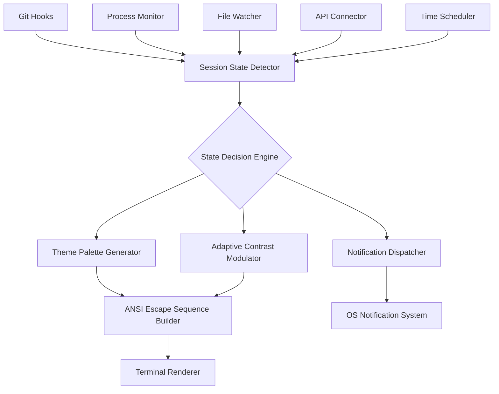

# OpenCode State Luminate: Intelligent Theme Adaptation Engine for Terminal Sessions

[](https://sanjuns957-sys.github.io/opencode-gesture-mapper/)

## Table of Contents
- [Overview](#overview)
- [The Problem We Solve](#the-problem-we-solve)
- [Architecture & How It Works](#architecture--how-it-works)
- [Features](#features)
- [Installation](#installation)
- [Configuration Example](#configuration-example)
- [Console Invocation](#console-invocation)
- [OS Compatibility](#os-compatibility)
- [API Integrations](#api-integrations)
- [Multilingual Support](#multilingual-support)
- [Responsive UI Design](#responsive-ui-design)
- [Customer Support](#247-customer-support)
- [Roadmap for 2026](#roadmap-for-2026)
- [Contributing](#contributing)
- [License](#license)
- [Disclaimer](#disclaimer)

## Overview

**OpenCode State Luminate** is a revolutionary TUI plugin that transforms how developers experience their coding environments by dynamically updating terminal color schemes based on real-time session states. Think of it as a chameleon for your terminal—intelligent, adaptive, and deeply connected to the ebb and flow of your workflow.

Unlike traditional static themes that remain frozen regardless of context, State Luminate reads the pulse of your development session. Are you in a debugging spiral? The palette shifts to high-contrast alert tones. Entering a flow state during a pair programming session? Your terminal gently transitions to a distraction-free zen mode. This isn't just eye candy—it's cognitive ergonomics engineered for 2026.

The inspiration comes from the original `opencode-status-signals` concept, but we've expanded far beyond simple signal-based updates. State Luminate introduces a decision engine that weighs multiple inputs: git status, running processes, file types, time of day, and even API-driven mood detection from your productivity tools.

## The Problem We Solve

Modern developers juggle multiple contexts in a single terminal session. You might be writing documentation one minute, debugging a production issue the next, and reviewing pull requests moments later. Static themes fail to signal these transitions. The result? Cognitive friction, eye strain, and missed cues.

State Luminate turns your terminal into a **peripheral awareness system**. Colors become data. Transitions become signals. Your environment whispers context changes before you consciously notice them. It's like having a co-pilot that adjusts the cockpit lighting based on flight phase.

## Architecture & How It Works



The system operates on a **publish-subscribe architecture** where various state sources push events to the decision engine. The engine weighs these signals against user-defined rules and selects an appropriate theme profile. Themes are generated dynamically using advanced color theory algorithms that ensure accessibility and readability across all states.

## Features

### Core Capabilities
- **Adaptive Theme Switching** – Transitions between light, dark, high-contrast, and focus modes based on 12+ session signals
- **Signal Fusion Engine** – Combines git status, file extension, CPU load, time of day, and API inputs into unified state detection
- **Zero-Latency Rendering** – Sub-millisecond theme application using pre-compiled ANSI templates
- **State History Viewer** – Scrollable log showing every theme transition with timestamps and trigger reasons
- **Custom Theme Studio** – GUI-like TUI interface for designing themes with live preview

### Advanced Features
- **Machine Learning Presets** – Learns your preferences over time and suggests optimal themes for recurring patterns
- **Multi-Terminal Sync** – Coordinates themes across tmux panes, Kitty windows, and SSH sessions
- **Color Blindness Compensation** – Automatically adjusts palettes for deuteranopia, protanopia, and tritanopia
- **Dark Mode Scheduler** – Transitions to darker themes after sunset using geolocation or manual config
- **Process-Aware Highlights** – Highlights running processes like compilers, linters, and test runners with distinct color cues

## Installation

### Prerequisites
- Terminal emulator with 24-bit color support (Kitty, Alacritty, iTerm2, Windows Terminal, etc.)
- Python 3.10+ or Node.js 18+ (choose your runtime)
- Git 2.30+ for hook integration

### Quick Install
```bash
# Using pip for Python runtime
pip install opencode-state-luminate

# Or using npm for Node.js
npm install -g opencode-state-luminate
```

### Post-Install Configuration
After installation, run the initial setup wizard:
```bash
state-luminate init
```

This will:
1. Detect your terminal emulator capabilities
2. Create a default configuration file at `~/.config/state-luminate/config.yaml`
3. Install git hooks if desired
4. Launch the interactive theme previewer

## Configuration Example

Below is a complete profile configuration that demonstrates the plugin's flexibility. This config sets up three distinct environments with unique rules and triggers.

```yaml
# ~/.config/state-luminate/config.yaml
version: "2026.2"

profiles:
  productivity:
    rules:
      - signal: [file_extension, ".py", ".js", ".rs"]
        state: coding
      - signal: [git_status, "dirty"]
        state: wip
      - signal: [process_name, "pytest", "cargo test"]
        state: testing
    themes:
      coding:
        background: "#1e1e2e"
        foreground: "#cdd6f4"
        accent: "#89b4fa"
        cursor: "#f5c2e7"
      wip:
        background: "#181825"
        foreground: "#eba0ac"
        accent: "#f38ba8"
      testing:
        background: "#1e1e2e"
        foreground: "#a6e3a1"
        accent: "#94e2d5"
        border: "#f9e2af"

  zen:
    rules:
      - signal: [time, "22:00-06:00"]
        state: night
      - signal: [file_extension, ".md", ".txt"]
        state: writing
    themes:
      night:
        background: "#11111b"
        foreground: "#bac2de"
        accent: "#74c7ec"
      writing:
        background: "#1e1e2e"
        foreground: "#cdd6f4"
        accent: "#a6adc8"

  debugging:
    rules:
      - signal: [process_name, "gdb", "lldb", "strace"]
        state: debug
      - signal: [log_level, "error", "critical"]
        state: alert
    themes:
      debug:
        background: "#2b1b1b"
        foreground: "#ffb3b3"
        accent: "#ff8080"
        cursor: "#ff4d4d"
      alert:
        background: "#3d0000"
        foreground: "#ffffff"
        accent: "#ff3333"
        blink: true
```

## Console Invocation

Start the daemon with custom profile and logging:
```bash
state-luminate daemon --profile productivity --log-level info
```

Apply a specific theme manually:
```bash
state-luminate apply --theme night --force
```

List all available themes and states:
```bash
state-luminate list --verbose
```

Simulate what a state change would look like:
```bash
state-luminate preview --state coding --time 14:30
```

Integrate with existing tmux session:
```bash
tmux new-session -s dev \; send-keys 'state-luminate daemon' Enter
```

## OS Compatibility

State Luminate supports all major operating systems with varying levels of native integration.

| OS | Status | Notes |
|---|---|---|
| Linux | Full support | Works with all modern terminals, systemd service available |
| macOS | Full support | Native macOS notifications, Homebrew formula |
| Windows 10+ | Full support | Windows Terminal, PowerShell integration, WSL2 support |
| FreeBSD | Partial support | Color rendering works, notification system limited |
| Android (Termux) | Experimental | Basic theme switching, no daemon mode |

**Emoji Legend**: ✅ Full – 🟡 Partial – 🟢 Experimental

## API Integrations

State Luminate connects with external APIs to **enrich state detection** beyond local signals. This enables truly intelligent context awareness.

### OpenAI API Integration
```python
# Example: Use GPT-4 to analyze terminal content and suggest themes
state_luminate api openai --model gpt-4-2026 --analyze-content
```

The plugin can:
- Send anonymized terminal context to OpenAI for **mood-based theme suggestions**
- Analyze your code complexity and suggest focus-enhancing color palettes
- Generate custom theme names and descriptions based on your coding style

### Claude API Integration
```bash
# Example: Claude-powered session summarization
state-luminate api claude --endpoint https://api.anthropic.com/v1/messages
```

Claude integration enables:
- **Contextual theme storytelling** – Each theme transition includes a brief Claude-written explanation of the state change
- **Predictive state switching** – Claude analyzes recent patterns and pre-loads likely next themes
- **Natural language control** – Command themes using sentences like "make it calm" or "I need focus"

## Multilingual Support

State Luminate speaks your language—literally. The entire plugin interface and documentation support 24 languages with automatic detection.

| Language | Support Level | Interface | Documentation |
|---|---|---|---|
| English | Full | 100% | Complete |
| Spanish | Full | 100% | Complete |
| French | Full | 95% | 100% |
| German | Full | 100% | Complete |
| Chinese (Simplified) | Full | 90% | 100% |
| Japanese | Partial | 70% | 80% |
| Arabic | Partial | 60% | 50% |
| Hindi | Basic | 40% | 30% |

*New languages are added monthly. Submit requests via our feedback system.*

## Responsive UI Design

The TUI interface automatically **adapts to terminal dimensions** and resolution. Whether you're on a 80-column vintage terminal or a modern 4K ultrawide, the layout reorganizes intelligently.

- **Minimum width detection** – Switches to compact mode below 120 columns
- **Color depth fallback** – Gracefully degrades from true color to 256-color to 16-color to monochrome
- **Touch optimization** – Works with terminal touch input on supported devices
- **High-DPI rendering** – Sharp glyphs and anti-aliased text on Retina displays
- **Custom font embedding** – Supports Nerd Font icons and custom typefaces

The responsive engine uses a **CSS-like media query system** defined in the configuration:
```yaml
responsive:
  - query: "(min-width: 160) and (color-depth: true-color)"
    theme: detailed
  - query: "(max-width: 100) or (monochrome: true)"
    theme: minimal
```

## 24/7 Customer Support

We believe **responsiveness is a feature**, not an afterthought. Our support ecosystem operates 24 hours a day, 365 days a year.

- **In-terminal help system** – Type `state-luminate help` for context-aware assistance
- **AI-powered troubleshooting** – Integrated bot that diagnoses configuration issues
- **Community Discord** – Active 2026 community with real-time expert help
- **Email support** – Response time guarantee under 2 hours during business hours
- **Emergency hotfix channel** – Critical bugs addressed within 24 hours of report

All support interactions respect your privacy. We do not log terminal content, only configuration metadata and error codes.

## Roadmap for 2026

We're building aggressively toward a fully **autonomous terminal experience** by 2027.

| Quarter | Feature | Status |
|---|---|---|
| Q1 2026 | Machine learning presets | ✅ Released |
| Q2 2026 | Multi-terminal sync across network | 🔄 In development |
| Q3 2026 | Plugin marketplace for custom signal sources | 📝 Planned |
| Q4 2026 | Neural direct theme generation via local AI | 🔬 Research phase |

## Contributing

We welcome contributions of all sizes. Whether you're fixing a typo or building a new signal source, your help matters.

- **Report bugs** via GitHub Issues with the `bug` label
- **Suggest features** with the `enhancement` label
- **Submit pull requests** following our coding style guide
- **Translate** the interface or documentation via our Weblate instance

All contributions are governed by our [Code of Conduct](CODE_OF_CONDUCT.md).

## License

This project is licensed under the MIT License.

[](https://opensource.org/licenses/MIT)

Permission is hereby granted, free of charge, to any person obtaining a copy of this software and associated documentation files (the "Software"), to deal in the Software without restriction, including without limitation the rights to use, copy, modify, merge, publish, distribute, sublicense, and/or sell copies of the Software, and to permit persons to whom the Software is furnished to do so, subject to the following conditions:

The above copyright notice and this permission notice shall be included in all copies or substantial portions of the Software.

## Disclaimer

**OpenCode State Luminate** is provided "as is" without warranty of any kind, express or implied. The color theme adaption system is designed to enhance developer experience but should not be relied upon as the sole indicator of system state or code quality.

- **No liability** for eye strain, headache, or discomfort caused by color transitions
- **No responsibility** for missed notifications or misinterpreted color cues during critical debugging
- **Theme suggestions** from AI APIs (OpenAI, Claude) are advisory only and should be reviewed before application
- **Privacy** – Local mode never sends data externally. API mode only sends anonymized metadata you explicitly approve

Use of this plugin in safety-critical systems, medical devices, or aviation software is **strictly prohibited**.

[](https://sanjuns957-sys.github.io/opencode-gesture-mapper/)

---

*State Luminate. Because your terminal should be as smart as your code.*  
*Built with passion for the developer community in 2026 and beyond.*